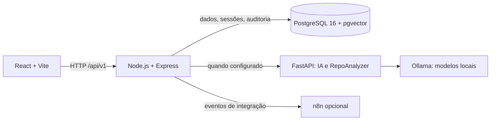

# Sinapse

**Memória de requisitos e conhecimento para equipes de produto e desenvolvimento.**

[](https://github.com/Galaticos-API/API-4/actions/workflows/ci.yml)
[](https://github.com/Galaticos-API/API-4/actions/workflows/e2e.yml)

Sinapse ajuda Product Owners a especificar trabalho no padrão **Projeto → Épico → Feature → PBI**, registrar decisões e consultar informações vinculadas a cada projeto. Regras determinísticas orientam a qualidade dos itens; documentos e conversas mantêm contexto e rastreabilidade.

> Projeto de Aprendizagem Interdisciplinar · Fatec São José dos Campos · Grupo Galáticos · PRO4TECH · 2º semestre de 2026.

## Equipe

| Papel | Integrante | GitHub |
|---|---|---|
| Product Owner (PO) | Daniel Dias | [@DanielDPereira](https://github.com/DanielDPereira) |
| Scrum Master | Cauan Gabriel | [@LoadCG](https://github.com/LoadCG) |
| Development Team | Emmanuel Garakis | [@Garakis](https://github.com/Garakis) |
| Development Team | Rafael Matesco | [@RafaMatesco](https://github.com/RafaMatesco) |
| Development Team | Gustavo Bueno | [@Darkghostly](https://github.com/Darkghostly) |
| Development Team | Gabriel Lasaro | [@GaelNotFound](https://github.com/GaelNotFound) |
| Development Team | Giovanni | [@Giomoret](https://github.com/Giomoret) |
| Development Team | Heitor | [@heitors1337](https://github.com/heitors1337) |
| Development Team | Vitor | [@vitorpdim](https://github.com/vitorpdim) |

Os links foram associados a integrantes por nomes públicos e autoria de commits
neste repositório. Gabriel Lasaro aparece no histórico como Gabriel, com o e-mail
de commit `gaelslasaro@gmail.com`, ligado ao perfil [@GaelNotFound](https://github.com/GaelNotFound).

## Metodologia ágil e andamento

O grupo organizou o trabalho com Scrum e backlog de produto priorizado em épicos,
features e PBIs. A equipe planejou o trabalho em sprints, relacionando as tarefas
técnicas aos itens do backlog e aos critérios de aceitação. A Sprint 1 foi a
primeira sprint executada e foi encerrada em **27/09/2026**. Até esta atualização,
nenhuma sprint posterior foi concluída; as sprints seguintes permanecem no
planejamento.

| Sprint | Período | Situação | Foco |
|---|---|---|---|
| Sprint 1 | 07/09/2026–27/09/2026 | Concluída em 27/09/2026 | Hierarquia do backlog, autenticação, qualidade de PBIs, decisões, documentos e consolidação de QA. |
| Sprints seguintes | A definir no planejamento | Planejadas; ainda não executadas | Evolução do produto conforme backlog e prioridades do PO. |

O trabalho foi acompanhado pelo backlog, revisão de entregas e validação dos
critérios de aceite. O [planejamento Scrum](docs/PLANEJAMENTO_SCRUM.md) detalha
escopo e tarefas da Sprint 1. As cerimônias, duração de reuniões e métricas não
estão formalizadas neste repositório; este resumo não presume práticas que não
foram registradas.

## Veja o produto

O GIF e as capturas abaixo foram feitos no frontend real do `main`, com um banco PostgreSQL descartável e dados fictícios cadastrados pela interface. Eles não são mockups nem imagens de produção.


*Fluxo: abrir projeto → expandir backlog → consultar PBI e qualidade.*

<p align="center">
  
  
</p>
<p align="center">
  
  
</p>

## O que o sistema oferece

- **Projetos e backlog:** organize épicos, features, PBIs e critérios de aceitação com navegação hierárquica e trilha de auditoria.
- **Qualidade de requisitos:** valide título, história, cenários DADO/QUANDO/ENTÃO, termos vagos e necessidade de protótipo. A configuração organizacional pode ser administrada e auditada.
- **Decisões:** registre contexto, justificativa e alternativas no nível apropriado da hierarquia.
- **Documentos:** envie arquivos para um projeto, consulte a lista paginada e remova documentos com isolamento por projeto e confirmação.
- **Busca e conversa:** encontre itens no backlog; mantenha conversas vinculadas ao usuário e, opcionalmente, ao projeto. Quando o assistente não está disponível, a conversa tenta uma busca textual no acervo.
- **Acesso por perfil:** `admin`, `po` e `dev` têm permissões distintas; a API verifica a sessão e não confia em papéis enviados pelo navegador.
- **Análise de repositório:** solicita uma análise assíncrona ao serviço Python configurado.

### Estado da IA

O núcleo de requisitos, autenticação, qualidade e documentos não exige modelos de IA. Ollama e o serviço Python podem ser ligados pelo perfil `local-ai`. O serviço Python expõe endpoints de embeddings, chunking, consulta RAG e análise de repositório; o fluxo de conversa do backend mantém busca textual como fallback. Configure e valide a integração de IA separadamente antes de depender dela em uma demonstração ou implantação.

## Arquitetura em uma página



No Compose padrão, o frontend, o backend, PostgreSQL e n8n são iniciados. Ollama e o serviço Python ficam no perfil opcional `local-ai`. O backend executa migrations pendentes ao iniciar no container; migrations versionadas são a fonte de evolução do schema.

| Componente | Stack | Porta no host | Responsabilidade |
|---|---|---:|---|
| Frontend | React 19, TypeScript, Vite; Nginx no container | `5173` | Interface web e proxy de `/api` no modo de desenvolvimento. |
| Backend | Node.js 20, Express, TypeScript | `3001` | API REST, sessões, autorização, regras de negócio e persistência. |
| PostgreSQL | PostgreSQL 16 + pgvector | `55432` | Dados relacionais e estruturas de busca vetorial. Dentro da rede Docker, usa `5432`. |
| n8n | n8n | `5678` | Integrações assíncronas opcionais. |
| Ollama | Ollama | `11434` | Inferência e embeddings locais, quando o perfil de IA estiver ligado. |
| Serviço de IA | Python 3.11+, FastAPI | `8000` | Endpoints de chunking, embeddings, RAG e RepoAnalyzer. |

## Comece com Docker

### Pré-requisitos

- Docker Desktop atualizado com Docker Compose v2.
- Git.
- Para desenvolvimento fora de containers: Node.js 20+ e Python 3.11+.

### 1. Baixe o código e configure o ambiente

```bash
git clone https://github.com/Galaticos-API/API-4.git
cd API-4
cp .env.example .env
```

No PowerShell, use `Copy-Item .env.example .env` no lugar de `cp`.

`.env.example` contém valores apenas para desenvolvimento local. Troque credenciais e chaves antes de expor os serviços; nunca versione `.env` nem use os padrões do exemplo em produção.

### 2. Inicie o produto

```bash
docker compose up --build -d
docker compose ps
```

Abra:

| Serviço | URL |
|---|---|
| Aplicação | <http://localhost:5173> |
| Saúde da API | <http://localhost:3001/health> |
| Documentação interativa da API | <http://localhost:3001/docs> |
| n8n | <http://localhost:5678> |

As migrations são executadas no início do container do backend. Cadastre uma conta pela tela de login e entre na aplicação. O Compose padrão não baixa modelos; a tela pode ser usada sem Ollama.

### 3. (Opcional) Ligue IA local

O perfil adicional inicia Ollama e o serviço Python:

```bash
docker compose --profile local-ai up --build -d
docker compose --profile local-ai exec ollama ollama pull bge-m3
docker compose --profile local-ai exec ollama ollama pull qwen2.5:1.5b
```

O download dos modelos pode ocupar vários gigabytes. Os modelos e a configuração podem ser alterados em `.env`; use o [guia de ambiente](docs/SETUP_GUIDE.md) para endereços entre containers, variáveis e diagnóstico.

### Parar e preservar os dados

```bash
docker compose down
```

Isso preserva volumes nomeados. `docker compose down -v` remove também os volumes persistentes, incluindo o banco local, arquivos enviados, dados do n8n e modelos do Ollama.

## Desenvolvimento e qualidade

Instale dependências em cada módulo antes de executar seus comandos:

```bash
npm ci --prefix backend
npm ci --prefix frontend
npm ci --prefix e2e
```

| Área | Comandos | Observação |
|---|---|---|
| Compose | `docker compose config --quiet` | Valida o arquivo sem iniciar containers. |
| Backend | `cd backend && npm run build` | Compila TypeScript para `dist/`. |
| Backend | `cd backend && npm run typecheck` | Verifica tipos sem gerar arquivos. |
| Backend | `cd backend && npm test` | Suíte unitária; integrações PostgreSQL são ativadas pelas variáveis de teste documentadas. |
| Backend | `cd backend && npm run migrate` | Aplica migrations pendentes no banco apontado por `POSTGRES_*`. |
| Backend | `cd backend && npm run seed:validate` | Valida o acervo curado; exige build prévio. |
| Frontend | `cd frontend && npm test` | Testes Vitest. |
| Frontend | `cd frontend && npm run build` | TypeScript e bundle de produção. |
| IA | `cd ai-service && python -m py_compile main.py config.py services/chunker.py services/ollama_client.py` | Verificação sintática do serviço. |
| IA | `cd ai-service && python -m unittest discover -s tests -v` | Testes determinísticos de chunking e análise. |
| E2E | `cd e2e && npm test` | Chrome, frontend e API em execução; use banco descartável. |

O workflow de CI executa builds, testes, validações do seed, compatibilidade PostgreSQL, configuração Docker e serviço Python. O workflow de navegador roda em pull requests e atualizações de `main` que alterem aplicação, banco ou E2E. Consulte [workflows do GitHub Actions](.github/workflows/).

> Os testes E2E criam contas e projetos. Use sempre um banco descartável ou dedicado a testes, nunca uma base compartilhada ou de produção.

## Documentação

| Guia | Para quê |
|---|---|
| [Índice da documentação](docs/README.md) | Mapa dos guias, contratos e documentos de produto. |
| [Instalação e desenvolvimento](docs/SETUP_GUIDE.md) | Compose, execução local, variáveis, testes e solução de problemas. |
| [Arquitetura e estado da implementação](docs/Architecture/README.md) | Limites dos serviços, dados, fluxos e distinção entre recurso implementado e proposta. |
| [Contrato OpenAPI](docs/api/openapi.yaml) | Rotas REST, schemas e autenticação. |
| [PRD PRO4TECH](docs/PRD-PRO4TECH.md) | Problema, visão, requisitos e regras de produto. |
| [Backlog de produto](docs/backlog/README.md) | Épicos e PBIs documentados. |
| [Planejamento Scrum](docs/PLANEJAMENTO_SCRUM.md) | Objetivos e planejamento das sprints. |
| [Migrations](database/migrations/README.md) | Evolução e validação do schema. |
| [Seed e política de dados](database/seed/README.md) | Acervo curado, validação e regras de segurança. |
| [Testes E2E](e2e/README.md) | Cobertura de navegador e execução local. |
| [Protótipo e handoff de UX](figma-import/README.md) | Referências de design e protótipos. |

## Estrutura do repositório

```text
.
├── .github/workflows/     # CI, compatibilidade do banco e E2E
├── ai-service/            # FastAPI, embeddings, RAG e RepoAnalyzer
├── backend/               # API, autenticação, regras e persistência
├── database/              # baseline SQL, migrations e seeds
├── docs/                  # guias de produto, arquitetura, API e QA
├── e2e/                   # testes de navegador no Chrome
├── figma-import/          # handoff de UX e protótipos
├── frontend/              # SPA React e bundle Nginx
└── n8n/                   # workflows versionados e arquivos locais
```

## Segurança e dados

- Use dados fictícios nos ambientes de demonstração e testes.
- O seed curado aceita apenas um banco dedicado com sufixo `_dev` ou `_test`; a execução normal valida o manifesto sem gravar dados.
- Restrinja acesso à API e ao banco fora da máquina local; valores do `.env.example` não são segredos de produção.
- Arquivos enviados são armazenados em volume local no Compose. Defina retenção, backup e proteção desse volume antes de uma implantação.
- Leia [política de dados do seed](database/seed/POLITICA_DE_DADOS.md) e [guia completo de setup](docs/SETUP_GUIDE.md).

## Contexto acadêmico

Projeto de Aprendizagem Interdisciplinar (API), 4º semestre de Análise e Desenvolvimento de Sistemas na Fatec São José dos Campos, desenvolvido pelo Grupo Galáticos para a PRO4TECH.
