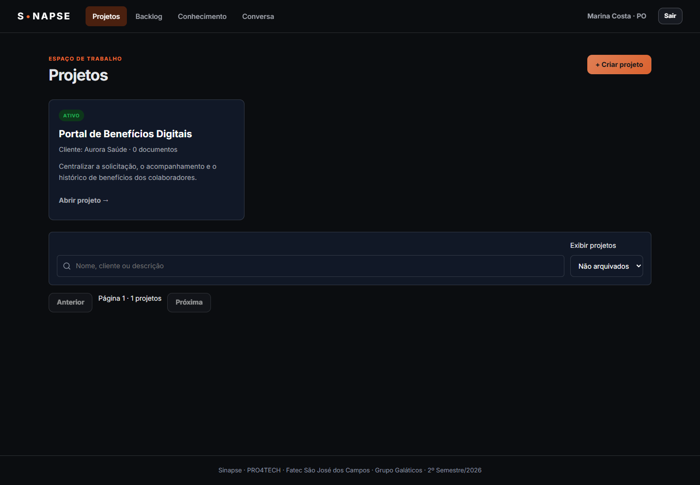
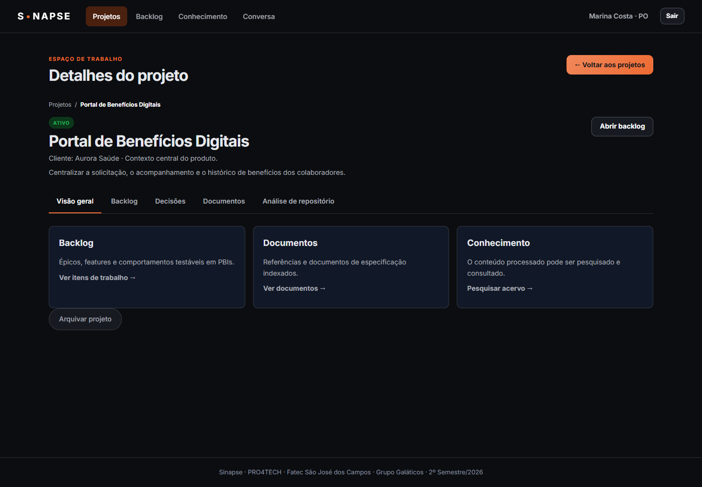
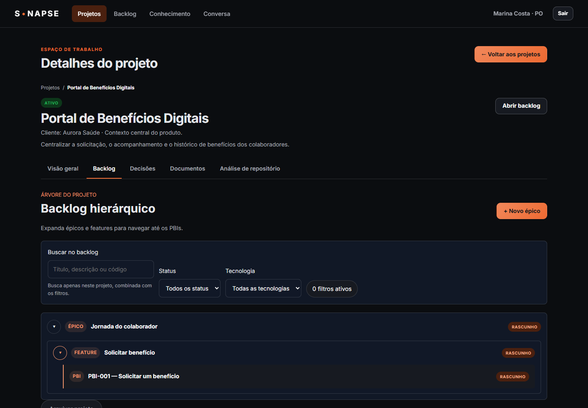
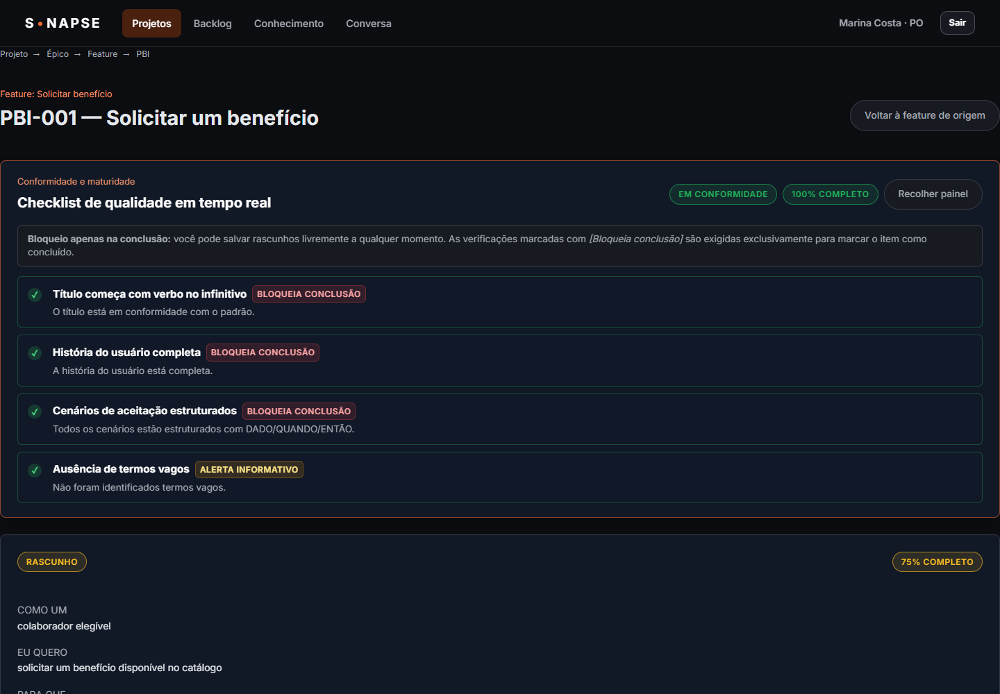
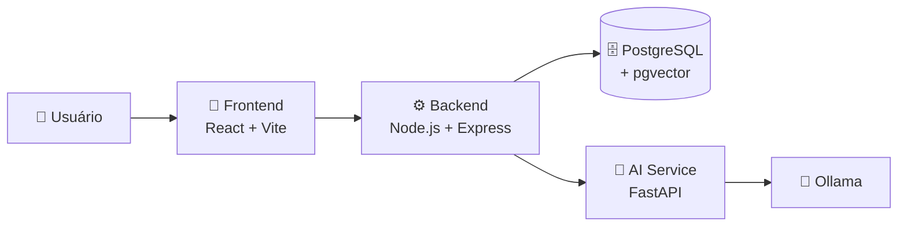

# 🧠 Sinapse

> **Organize requisitos. Centralize conhecimento. Desenvolva com contexto.**

O **Sinapse** é uma plataforma para organização e gerenciamento de requisitos de software, desenvolvida pelo **Grupo Galáticos** para a **PRO4TECH**.

A aplicação permite estruturar projetos em **Épicos, Features e PBIs**, acompanhar a qualidade dos requisitos e centralizar informações importantes, como documentos e decisões.

<br>

<div align="center">


</div>

---

## 🚀 Sobre o projeto

Em um projeto de software, requisitos, decisões e documentos podem acabar espalhados por diferentes ferramentas.

O **Sinapse** foi desenvolvido para centralizar essas informações e facilitar o trabalho entre **Product Owners e equipes de desenvolvimento**.

A organização dos requisitos segue uma estrutura hierárquica:

```text
📁 Projeto
 └── 📦 Épico
      └── 🔹 Feature
           └── 📋 PBI
                └── ✅ Critérios de Aceitação
```

Essa estrutura permite acompanhar um requisito desde sua definição até seus critérios de aceitação e validação.

---

## 🎯 Sprint 1

A primeira sprint teve como objetivo construir a **base funcional do Sinapse** e implementar os principais recursos relacionados ao gerenciamento de projetos e requisitos.

### ✅ Principais entregas

| Entrega                                  | Status |
| ---------------------------------------- | :----: |
| 📁 Projetos                              |    ✅   |
| 📦 Épicos, Features e PBIs               |    ✅   |
| 🔐 Autenticação                          |    ✅   |
| 👥 Controle de acesso por perfil         |    ✅   |
| 📋 Critérios de aceitação                |    ✅   |
| 🧪 Validação da qualidade dos requisitos |    ✅   |
| 💡 Registro de decisões                  |    ✅   |
| 📄 Documentos                            |    ✅   |
| 🔎 Busca no backlog                      |    ✅   |
| 💬 Estrutura de conversas                |    ✅   |
| 🤖 Integração com recursos de IA         |    ✅   |
| 🧪 Testes automatizados                  |    ✅   |

**Sprint 1:** `07/09/2026 → 27/09/2026`

📌 [Planejamento completo da Sprint](docs/PLANEJAMENTO_SCRUM.md)

### 📍 Estado atual do trabalho

A Sprint 1 foi concluída em **27/09/2026**. A Sprint 2 está planejada para **05/10 a 25/10/2026**. A implementação candidata de ingestão, busca e avaliação está em [PR de revisão](https://github.com/Galaticos-API/API-4/pulls) e ainda não foi aceita: o baseline encontrou latência acima de 2 s e pendências de relevância (Q008 e Q022). Veja o [registro QA](docs/STATUS_REVISAO_2026-10-02.md) para evidências, limites e próximos passos.

---

## 🖥️ Conheça o Sinapse

O sistema possui uma interface voltada para a navegação entre projetos e seus respectivos requisitos.

### Fluxo principal


> **Projeto → Backlog → PBI → Qualidade do requisito**

### 📸 Algumas telas

<div align="center">





<br><br>





</div>

---

# 🛠️ Tecnologias

O Sinapse utiliza uma arquitetura baseada em aplicações web, API REST, banco de dados relacional e serviços de IA.

### 🎨 Frontend

<p>
  
</p>

* **React 19** — construção da interface
* **TypeScript** — tipagem e desenvolvimento
* **Vite** — build e ambiente de desenvolvimento
* **Vitest** — testes
* **Testing Library** — testes de interface
* **Lucide React** — ícones

### ⚙️ Backend

<p>
  
</p>

* **Node.js 20**
* **Express**
* **TypeScript**
* API REST
* Autenticação e autorização
* Regras de negócio

### 🗄️ Banco de dados

<p>
  
</p>

* **PostgreSQL 16**
* **pgvector**
* Migrations
* Seeds

### 🤖 Inteligência Artificial

<p>
  
</p>

* **Python**
* **FastAPI**
* **Ollama**
* Embeddings
* RAG
* Análise de repositórios

### 🔧 Infraestrutura e ferramentas

<p>
  
</p>

* **Docker / Docker Compose**
* **Nginx**
* **GitHub Actions**
* **n8n**
* **Git**

---

# 🏗️ Arquitetura

A aplicação é organizada em diferentes serviços:



### Componentes

| Componente    | Tecnologia                | Função                  |
| ------------- | ------------------------- | ----------------------- |
| 🎨 Frontend   | React + TypeScript + Vite | Interface da aplicação  |
| ⚙️ Backend    | Node.js + Express         | API e regras de negócio |
| 🗄️ Banco     | PostgreSQL + pgvector     | Persistência dos dados  |
| 🤖 AI Service | Python + FastAPI          | Recursos de IA          |
| 🧠 Modelos    | Ollama                    | Inferência local        |
| 🔄 Automação  | n8n                       | Integrações e workflows |

---

# 🔐 Funcionalidades

### 📁 Projetos e Backlog

Organização dos requisitos através da hierarquia:

**Projeto → Épico → Feature → PBI**

---

### 🧪 Qualidade dos requisitos

Os PBIs possuem verificações relacionadas à qualidade do requisito, incluindo:

* estrutura da história;
* critérios de aceitação;
* cenários **DADO / QUANDO / ENTÃO**;
* identificação de termos vagos;
* necessidade de protótipo.

As verificações são baseadas em regras determinísticas.

---

### 💡 Decisões

Permite registrar decisões relacionadas aos elementos do projeto, mantendo o contexto e a justificativa das escolhas realizadas.

---

### 📄 Documentos

Documentos podem ser associados aos projetos e posteriormente consultados ou removidos.

---

### 👥 Usuários e permissões

O sistema possui diferentes perfis:

```text
🔴 admin
🟡 po
🔵 dev
```

Cada perfil possui permissões específicas dentro da aplicação.

---

### 🔎 Busca e conversas

O Sinapse permite localizar informações do backlog e manter conversas relacionadas ao projeto.

A arquitetura também permite a integração com recursos de IA para consultas e recuperação de informações.

---

# ▶️ Como executar

## 📋 Pré-requisitos

* 🐳 Docker Desktop
* Git
* Docker Compose v2

Para executar os serviços diretamente no sistema:

* Node.js 20+
* Python 3.11+

---

## 1️⃣ Clone o repositório

```bash
git clone https://github.com/Galaticos-API/API-4.git
cd API-4
```

---

## 2️⃣ Configure o ambiente

### Linux / macOS

```bash
cp .env.example .env
```

### Windows PowerShell

```powershell
Copy-Item .env.example .env
# Gere com: python -c "import secrets; print(secrets.token_hex(32))"
# Cole o resultado na variável DOCUMENT_INGESTION_TOKEN dentro do arquivo .env
```

---

## 3️⃣ Inicie o projeto

```bash
docker compose up --build -d
```

O Compose exige esse segredo compartilhado pelo backend e pelo serviço local de IA; não há mais token padrão no código.

Verifique os containers:

```bash
docker compose ps
```

---

## 🌐 Acessos

| Serviço         | Endereço                     |
| --------------- | ---------------------------- |
| 🧠 Sinapse      | http://localhost:5173        |
| ⚙️ API          | http://localhost:3001        |
| ❤️ Health Check | http://localhost:3001/health |
| 📚 Swagger      | http://localhost:3001/docs   |
| 🔄 n8n          | http://localhost:5678        |

---

# 🧪 Testes

O projeto possui testes automatizados para diferentes partes da aplicação.

### Backend

```bash
cd backend
npm test
```

### Frontend

```bash
cd frontend
npm test
```

### E2E

```bash
cd e2e
npm test
```

### Build

Frontend:

```bash
cd frontend
npm run build
```

Backend:

```bash
cd backend
npm run build
```

---

# 📂 Estrutura do projeto

```text
.
├── .github/
│   └── workflows/       # CI e automações
│
├── ai-service/          # 🤖 Serviço de IA
├── backend/             # ⚙️ API e regras de negócio
├── database/            # 🗄️ Banco, migrations e seeds
├── docs/                # 📚 Documentação
├── e2e/                 # 🧪 Testes End-to-End
├── figma-import/        # 🎨 UX e protótipos
├── frontend/            # 🖥️ Aplicação React
└── n8n/                 # 🔄 Workflows
```

---

# 👥 Equipe

| Função              | Integrante       | GitHub                                               |
| ------------------- | ---------------- | ---------------------------------------------------- |
| 🎯 Product Owner    | Daniel Dias      | [@DanielDPereira](https://github.com/DanielDPereira) |
| 🧭 Scrum Master     | Cauan Gabriel    | [@LoadCG](https://github.com/LoadCG)                 |
| 💻 Development Team | Emmanuel Garakis | [@Garakis](https://github.com/Garakis)               |
| 💻 Development Team | Rafael Matesco   | [@RafaMatesco](https://github.com/RafaMatesco)       |
| 💻 Development Team | Gustavo Bueno    | [@Darkghostly](https://github.com/Darkghostly)       |
| 💻 Development Team | Gabriel Lasaro   | [@GaelNotFound](https://github.com/GaelNotFound)     |
| 💻 Development Team | Giovanni         | [@Giomoret](https://github.com/Giomoret)             |
| 💻 Development Team | Heitor           | [@heitors1337](https://github.com/heitors1337)       |
| 💻 Development Team | Vitor            | [@vitorpdim](https://github.com/vitorpdim)           |

---

# 📚 Documentação

Para informações mais específicas:

| Documento                                           | Conteúdo                 |
| --------------------------------------------------- | ------------------------ |
| 📋 [Planejamento Scrum](docs/PLANEJAMENTO_SCRUM.md) | Sprints e planejamento   |
| 📚 [Documentação](docs/README.md)                   | Índice dos documentos    |
| ⚙️ [Setup](docs/SETUP_GUIDE.md)                     | Configuração do ambiente |
| 🏗️ [Arquitetura](docs/Architecture/README.md)      | Arquitetura do sistema   |
| 🔌 [OpenAPI](docs/api/openapi.yaml)                 | Contrato da API          |
| 📋 [PRD](docs/PRD-PRO4TECH.md)                      | Requisitos do produto    |
| 🗂️ [Backlog](docs/backlog/README.md)               | Épicos e PBIs            |

---

# 🎓 Contexto acadêmico

O **Sinapse** é um **Projeto de Aprendizagem Interdisciplinar (API)** desenvolvido pelo **Grupo Galáticos**, no 4º semestre do curso de **Análise e Desenvolvimento de Sistemas da Fatec São José dos Campos**, para a empresa parceira **PRO4TECH**.

<br>

<div align="center">

### 🧠 Sinapse

**Grupo Galáticos · Fatec São José dos Campos · 2026**

</div>
