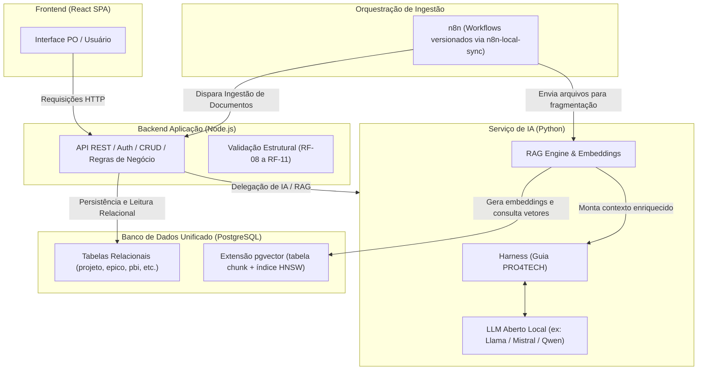
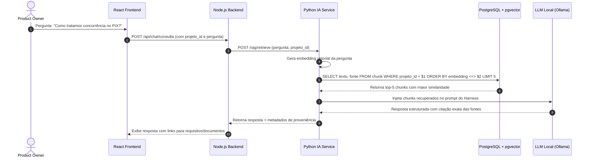
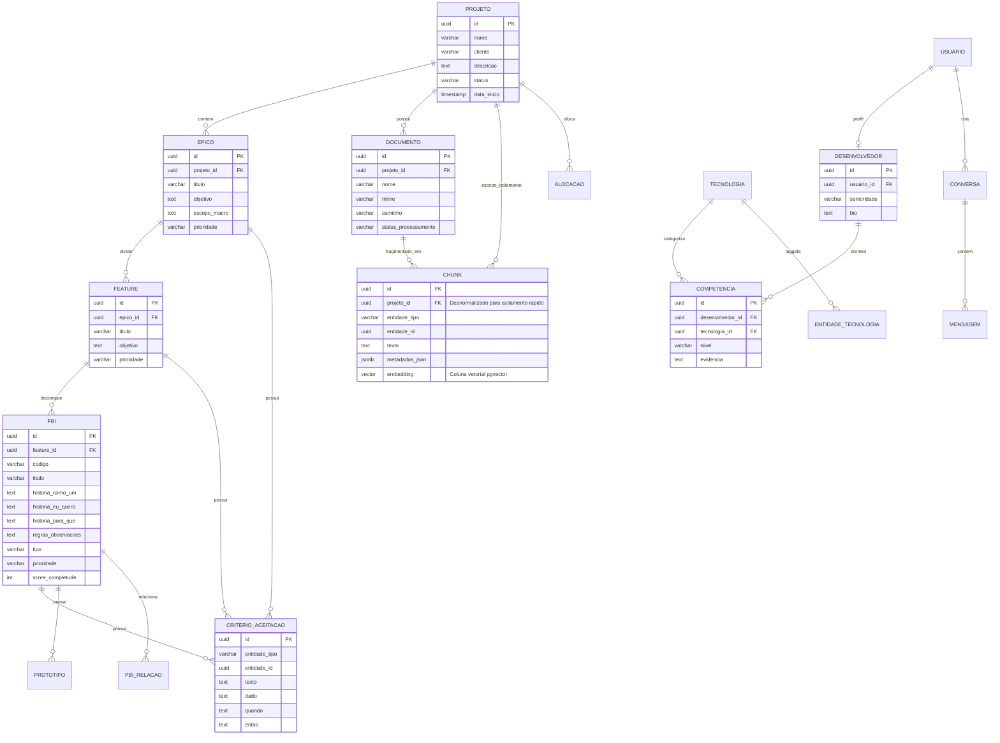

# Arquitetura e Diagramas do Sistema — Sinapse

> **PRO4TECH · Fatec São José dos Campos · Grupo Galáticos**  
> *Base Inteligente de Requisitos — Memória Institucional da Fábrica de Software*

Este documento consolida todos os diagramas arquiteturais, fluxos de execução e modelos de dados do **Sinapse**, servindo como referência visual e técnica central para a equipe de desenvolvimento e stakeholders, em conformidade com o [PRD](../PRD/PRD.md) e o [AGENTS.md](../AGENTS.md).

---

## 📑 Índice de Diagramas

1. [Visão Geral da Arquitetura e Ingestão](#1-visão-geral-da-arquitetura-e-ingestão)
2. [Fluxo de Consulta Semântica e RAG](#2-fluxo-de-consulta-semântica-e-rag)
3. [Diagrama Entidade-Relacionamento (ERD)](#3-diagrama-entidade-relacionamento-erd)
4. [Resumo das Fronteiras Arquiteturais](#4-resumo-das-fronteiras-arquiteturais)

---

## 1. Visão Geral da Arquitetura e Ingestão

Representa a divisão de responsabilidades entre as 6 camadas do ecossistema Sinapse:
- **Frontend (React SPA):** Interface do Product Owner.
- **Backend Aplicação (Node.js):** Ponto de entrada de negócio, autenticação, CRUD e validações determinísticas (RF-08 a RF-11). É o único serviço autorizado a persistir nas tabelas de negócio.
- **Serviço de IA (Python):** RAG Engine, chunking unificado (PRD 10.3) e Harness de alinhamento com o guia PRO4TECH.
- **Orquestração de Ingestão (n8n):** Monitoramento de arquivos em `/files`, gatilhos de eventos e workflows versionados via `n8n-local-sync`.
- **Banco de Dados Unificado (PostgreSQL):** Persistência relacional clássica combinada com a extensão `pgvector` (busca vetorial HNSW na tabela `chunk`).
- **Ollama:** Runtime de IA para inferência de LLM (Qwen 2.5 / Llama 3.1) e geração de embeddings locais (`bge-m3`).

### Diagrama Mermaid

🖼️ <b>Ver imagem estática renderizada</b>

---

## 2. Fluxo de Consulta Semântica e RAG

Ilustra o ciclo de vida completo de uma pergunta realizada pelo Product Owner em linguagem natural (ex: *"Como tratamos concorrência no PIX?"*):

1. O **PO** envia a pergunta através da SPA em React.
2. O **Backend Node.js** recebe a requisição, autentica o usuário e valida o `projeto_id` para garantir o isolamento por metadados.
3. O **Serviço Python de IA** gera o embedding vetorial da query utilizando o modelo configurado no Ollama (`bge-m3`).
4. O Python executa a busca híbrida no **PostgreSQL com pgvector**, aplicando filtro estrito por `projeto_id` e ordenação por distância de cosseno (`<=>`).
5. Os top-5 chunks mais relevantes retornam do banco para o Python.
6. O Python injeta os chunks no prompt controlado do **Harness** (com regras para não alucinar e citar fontes obrigatoriamente).
7. O **LLM local** processa o contexto e gera a resposta estruturada com citações exatas.
8. A resposta com metadados de proveniência é enviada de volta ao Node.js e renderizada na interface do PO com links rastreáveis para os requisitos e documentos de origem.

### Diagrama de Sequência Mermaid

🖼️ <b>Ver imagem estática renderizada</b>

.jpg)

---

## 3. Diagrama Entidade-Relacionamento (ERD)

Descreve a modelagem de dados relacional e vetorial unificada no PostgreSQL. 

### Destaques da Modelagem
- **Hierarquia de Requisitos:** `PROJETO` &rarr; `EPICO` &rarr; `FEATURE` &rarr; `PBI` &rarr; `CRITERIO_ACEITACAO`.
- **Rastreabilidade e Proveniência:** Critérios de aceitação com formato BDD (`dado`, `quando`, `entao`) e campos específicos para histórias de usuário (`historia_como_um`, `historia_eu_quero`, `historia_para_que`).
- **Isolamento de Conhecimento:** A tabela `CHUNK` armazena `projeto_id` desnormalizado para garantir que as buscas vetoriais não vazem informações entre projetos diferentes. A coluna `embedding` utiliza o tipo nativo `vector` do `pgvector`.
- **Mapeamento de Competências:** Relação `USUARIO` &rarr; `DESENVOLVEDOR` &rarr; `COMPETENCIA` &rarr; `TECNOLOGIA` para identificação de especialistas na equipe.

### Diagrama ERD Mermaid

🖼️ <b>Ver imagem estática renderizada</b>

.jpg)

---

## 4. Resumo das Fronteiras Arquiteturais

| Camada | Tecnologia | O que faz | O que NÃO faz |
|---|---|---|---|
| **Frontend** | React 19 / Vite / TS | Coleta entradas do PO, exibe acervo, renderiza chat e marca proveniência visualmente. | Não valida regras de negócio nem conversa direto com o banco ou Ollama. |
| **Backend** | Node.js 20+ / Express / TS | Autenticação, CRUD, validações determinísticas de conformidade (regex, termos vagos) e **única escrita nas tabelas de negócio**. | Não calcula embeddings nem executa RAG. |
| **Serviço de IA** | Python 3.11+ / FastAPI | **Fonte única da verdade para chunking**, gera embeddings, monta o contexto do Harness e consulta o LLM. | **Nunca grava diretamente nas tabelas de negócio** (devolve sugestões para confirmação humana). |
| **Ingestão** | n8n | Watch de pastas em `/files`, conversão de arquivos e gatilhos de disparo para `POST /ingest`. | Não define o tamanho dos chunks nem calcula vetores internamente. |
| **Banco** | PostgreSQL 16 + pgvector | Armazena dados relacionais estruturados e vetores de chunks indexados por HNSW. | Não expõe acesso direto para o cliente web. |
| **IA Local** | Ollama | Executa modelos de LLM e Embeddings localmente via API HTTP. | Não gerencia permissões de projeto ou regras de negócio da PRO4TECH. |
