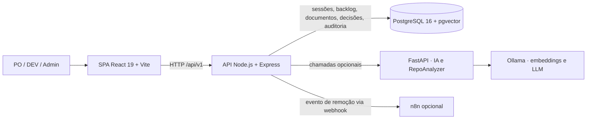
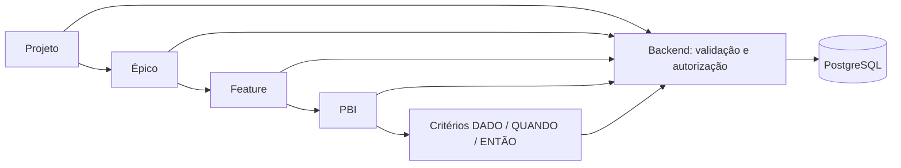

# Arquitetura do Sinapse

> Estado da implementação no `main`, revisado em 27/09/2026. Este documento descreve o que o código e a configuração Docker fazem hoje. Requisitos ainda em validação e propostas futuras estão identificados como tal.

## Visão de runtime


```mermaid
flowchart LR
    PO["PO / DEV / Admin"] --> Browser["SPA React 19 + Vite"]
    Browser -->|"HTTP /api/v1"| API["API Node.js + Express"]
    API -->|"sessões, backlog, documentos, decisões, auditoria"| DB[("PostgreSQL 16 + pgvector")]
    API -->|"chamadas opcionais"| AI["FastAPI · IA e RepoAnalyzer"]
    AI --> Ollama["Ollama · embeddings e LLM"]
    API -->|"evento de remoção via webhook"| N8N["n8n opcional"]
```

### Componentes e fronteiras

| Componente | Implementação | Responsabilidade atual |
|---|---|---|
| Frontend | `frontend/`, React + TypeScript + Vite; Nginx na imagem final | Autenticação de interface, navegação por projeto e captura de entradas. O Vite encaminha `/api` e `/health` no modo local; Nginx usa `backend:3001` no Compose. |
| Backend | `backend/`, Express + TypeScript | API, sessões, autorização por perfil, validações, regras de domínio, acesso ao Postgres, storage de documentos e histórico de conversa. |
| Banco | `database/init.sql` + `database/migrations/`, PostgreSQL 16 e extensão pgvector | Persistência do domínio, índices e estruturas para conteúdo de conhecimento. O backend aplica migrations pendentes ao iniciar o container. |
| Serviço Python | `ai-service/`, FastAPI | Endpoints de saúde, chunking, embeddings, consulta RAG e execução/consulta de análises de repositório. É executado no perfil Docker `local-ai`. |
| Ollama | container opcional | Provedor local de modelos de embedding e geração. Os modelos são baixados pelo operador; não vêm no build da imagem. |
| n8n | container padrão, integrações opcionais | Consumidor de eventos/integrador. O evento de remoção pode ser enviado por `DOCUMENT_EVENTS_WEBHOOK_URL`; sem URL, é retido e reprocessado. |

**Diretriz de dados:** o backend é a autoridade de negócio para autenticação, regras, autorização e mutações do domínio. Os clientes web e modelos não devem contornar essas validações. Configure acesso ao PostgreSQL apenas para serviços confiáveis na rede privada.

## Fluxos implementados

### Autenticação e autorização

1. A UI registra ou autentica a pessoa pela API.
2. O backend gerencia sessões e valida-as em cada rota protegida.
3. `admin`, `po` e `dev` são perfis de negócio. A autorização é validada na API; ocultar um botão no frontend não substitui a regra do backend.
4. O modo de leitura de um projeto arquivado também é aplicado no servidor para operações de escrita.

Veja [contrato da API](../api/openapi.yaml) e [guia de setup](../SETUP_GUIDE.md).

### Backlog e qualidade


```mermaid
flowchart LR
    P["Projeto"] --> E["Épico"] --> F["Feature"] --> B["PBI"] --> C["Critérios DADO / QUANDO / ENTÃO"]
    API["Backend: validação e autorização"] --> DB[("PostgreSQL")]
    P --> API
    E --> API
    F --> API
    B --> API
    C --> API
```

O backlog suporta leitura, escrita por perfis autorizados, relações de tecnologia, busca textual no projeto, decisões em diferentes níveis, arquivamento e auditoria. O painel de qualidade calcula verificações determinísticas e a aplicabilidade da regra de protótipo. A configuração de regras é versionada e alterações administrativas são atribuídas e auditadas.

### Documentos

1. A API valida nome, formato, tamanho, existência do projeto e estado de arquivamento.
2. O arquivo é salvo no storage configurado; metadados, auditoria e operação pendente são persistidos no banco.
3. Um worker retenta operações de storage e eventos de integração até concluir ou atingir a política configurada.
4. A listagem é paginada por cursor e sempre delimitada ao projeto.

O upload grava o arquivo e seus metadados; **isso não significa que o conteúdo já foi extraído ou indexado**. A extração, geração de embeddings e persistência de chunks dependem do pipeline de conhecimento configurado. Consulte [documentação de integração](../DOCUMENTOS_INTEGRACAO.md).

### Busca e conversa

O backend guarda conversas e mensagens por usuário, valida a posse da conversa e, quando informado, limita a consulta ao projeto escolhido. Tenta consultar o cliente HTTP de IA configurado; diante de indisponibilidade ou resposta inválida, procura trechos existentes no Postgres usando os termos da pergunta e devolve as fontes encontradas. Sem evidência, responde que a informação não foi encontrada.

**Integração em validação:** o serviço Python e o cliente HTTP do backend evoluíram contratos de requisição/resposta independentes. O fluxo de IA deve ser validado de ponta a ponta (backend → FastAPI → Ollama) antes de ser anunciado como funcional em um ambiente. Os testes E2E cobrem o chat com serviço indisponível e seu fallback; eles não certificam inferência local.

### Análise de repositório

O backend valida o projeto e a URL do GitHub, pede ao FastAPI para iniciar uma execução e persiste o identificador recebido. Consultas seguintes sincronizam estágio, progresso e relatório. O acesso ao projeto e o estado de arquivamento são revalidados nas rotas.

## Dados e evolução do schema

- `database/init.sql` é o baseline aplicado quando um volume PostgreSQL é inicializado pela primeira vez.
- `database/migrations/NNN_*.sql` contém alterações posteriores. O runner aplica arquivos pendentes em transação e registra os nomes completos em `_schema_migrations`.
- As duas migrations `004` e as duas migrations `005` são histórico publicado; não as renomeie. A ordenação lexicográfica atual é intencional.
- PostgreSQL armazena usuários/sessões, projetos, hierarquia do backlog, critérios, decisões, documentos, chunks, conversas, configurações de qualidade e auditoria.
- `pgvector` está disponível para embeddings; a existência da coluna ou extensão, isoladamente, não prova que um pipeline de ingestão está ativo.

Para alterações, crie uma nova migration idempotente quando possível. Não reescreva `init.sql` para reparar volumes já existentes. Consulte [guia de migrations](../../database/migrations/README.md).

## Deploy local

```text
Compose padrão:  frontend + backend + PostgreSQL/pgvector + n8n
Perfil local-ai: Ollama + FastAPI
```

No Compose, o backend acessa `postgres:5432` e a interface usa Nginx para encaminhar `/api` a `backend:3001`. Processos locais no host usam portas publicadas — PostgreSQL `55432`, API `3001` e frontend `5173` por padrão. URLs e credenciais estão em `.env`; `.env.example` serve apenas a ambientes locais.

## Qualidade e operações

- CI: build/typecheck, suites backend/frontend, testes PostgreSQL, validação do seed, configuração Compose e testes Python.
- E2E: cenários de navegador com API e PostgreSQL reais, incluindo autorização, isolamento, documentos, hierarquia e acessibilidade.
- Healthchecks: `/health` no backend e serviço Python.
- Logs e migrations: use `docker compose logs -f backend` e consulte `_schema_migrations` antes de investigar divergência de schema.

Comandos completos e variáveis ficam no [guia de setup](../SETUP_GUIDE.md). Matriz de cobertura no [README E2E](../../e2e/README.md).

## Propostas e referências históricas

GraphRAG, extração de relações em grafo e os benchmarks de embeddings são propostas/experimentos de evolução; não são componentes que o Compose padrão instala. Mantenha essas hipóteses vinculadas às referências e atualize este status quando houver implementação e validação correspondentes.

- [Diagramas Mermaid](Diagrams/Architecture.mmd)
- [Diagrama de arquitetura e ingestão](Diagrams/Vis%C3%A3o%20Geral%20da%20Arquitetura%20e%20Ingest%C3%A3o.jpg)
- [Fluxo conceitual RAG](Diagrams/RAG.mmd)
- [ERD](Diagrams/ERD.mmd)
- [PRD e requisitos de produto](../PRD-PRO4TECH.md)
- [PRD](../PRD-PRO4TECH.md)
